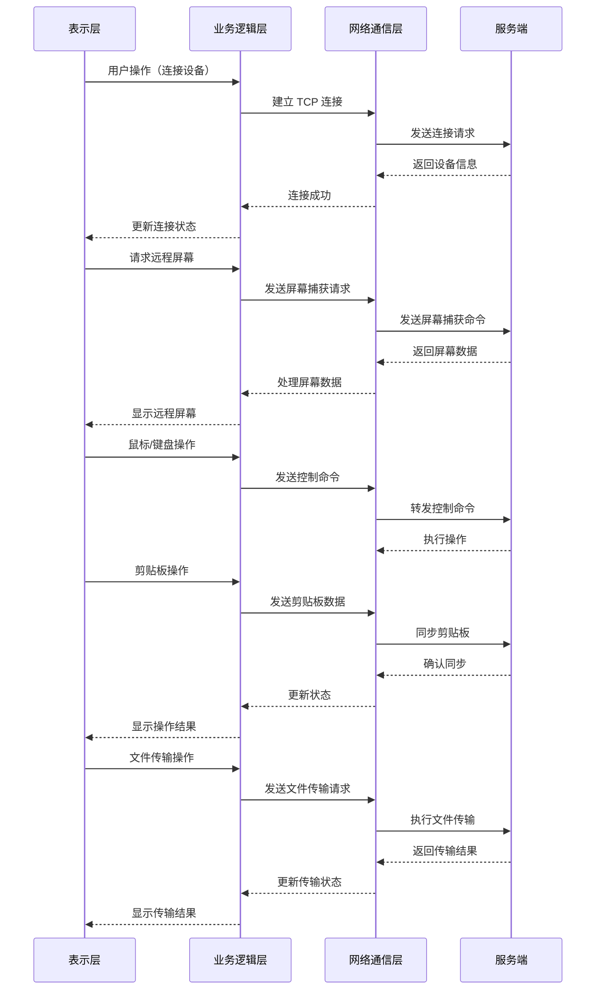

# HarmonyOS 客户端架构分析

## 1. 整体架构设计

### 1.1 架构概述

HarmonyOS 远程桌面控制客户端采用分层架构设计，参考 Java 客户端的核心功能，同时适配 HarmonyOS 平台特性。整体架构分为以下几层：

1. **表示层**：UI 界面，负责用户交互和界面展示
2. **业务逻辑层**：核心业务逻辑，处理远程控制、剪贴板同步、文件传输等功能
3. **网络通信层**：负责与服务端的通信，包括 TCP 连接和 HTTP 请求
4. **数据层**：负责数据存储和管理

### 1.2 核心流程图



## 2. 项目结构

### 2.1 目录结构

```
HarmonOS_remote_desktop_control_client/
├── AppScope/
│   ├── app.json5              # 应用配置文件
│   └── resources/             # 应用资源
├── entry/
│   ├── src/
│   │   ├── main/
│   │   │   ├── ets/           # ArkTS 源码
│   │   │   │   ├── entryability/  # 入口ability
│   │   │   │   ├── pages/         # 页面
│   │   │   │   ├── components/    # 组件
│   │   │   │   ├── services/      # 服务
│   │   │   │   ├── models/        # 数据模型
│   │   │   │   ├── network/       # 网络通信
│   │   │   │   ├── utils/         # 工具类
│   │   │   │   └── constants/     # 常量
│   │   │   └── resources/        # 页面资源
│   │   └── test/                # 测试代码
│   ├── build-profile.json5      # 构建配置
│   └── hvigorfile.ts           # 构建脚本
├── docs/                       # 文档
├── build-profile.json5         # 应用构建配置
└── oh-package.json5            # 依赖配置
```

### 2.2 核心模块结构

| 模块 | 职责 | 文件位置 |
|------|------|----------|
| 网络通信 | 处理与服务端的 TCP 连接和 HTTP 请求 | entry/src/main/ets/network/ |
| 远程控制 | 处理鼠标、键盘控制和屏幕捕获 | entry/src/main/ets/services/remote/ |
| 剪贴板 | 处理剪贴板同步 | entry/src/main/ets/services/clipboard/ |
| 文件传输 | 处理文件上传和下载 | entry/src/main/ets/services/file/ |
| 界面 | 提供用户交互界面 | entry/src/main/ets/pages/ |
| 组件 | 可复用 UI 组件 | entry/src/main/ets/components/ |
| 数据模型 | 定义数据结构 | entry/src/main/ets/models/ |
| 工具类 | 提供通用功能 | entry/src/main/ets/utils/ |

## 3. 核心模块实现

### 3.1 网络通信模块

#### 3.1.1 TCP 连接管理

```typescript
// entry/src/main/ets/network/TcpClient.ts
import socket from '@ohos.net.socket';
import { Cmd } from '../models/Cmd';
import { NettyDecoder } from './NettyDecoder';
import { NettyEncoder } from './NettyEncoder';

export class TcpClient {
  private tcpSocket: socket.TCPSocket;
  private serverIp: string;
  private serverPort: number;
  private messageHandler: (data: ArrayBuffer) => void;
  
  constructor(serverIp: string, serverPort: number, messageHandler: (data: ArrayBuffer) => void) {
    this.serverIp = serverIp;
    this.serverPort = serverPort;
    this.messageHandler = messageHandler;
    this.tcpSocket = socket.constructTCPSocketInstance();
  }
  
  public connect(): Promise<void> {
    return new Promise((resolve, reject) => {
      this.tcpSocket.connect({
        address: {
          family: 1, // AF_INET
          address: this.serverIp,
          port: this.serverPort
        }
      }, (err) => {
        if (err) {
          reject(err);
          return;
        }
        
        // 设置消息接收回调
        this.tcpSocket.on('message', (data) => {
          this.messageHandler(data);
        });
        
        resolve();
      });
    });
  }
  
  public send(cmd: Cmd): void {
    const encoder = new NettyEncoder();
    const buffer = encoder.encode(cmd);
    
    this.tcpSocket.send({
      data: buffer
    }, (err, bytesSent) => {
      if (err) {
        console.error('Send failed:', err);
      }
    });
  }
  
  public disconnect(): void {
    this.tcpSocket.close();
  }
  
  public isConnected(): boolean {
    // 检查连接状态
    return true; // 实际实现需要根据 HarmonyOS API 检查
  }
}
```

#### 3.1.2 HTTP 客户端

```typescript
// entry/src/main/ets/network/HttpClient.ts
import http from '@ohos.net.http';

export class HttpClient {
  private httpRequest: http.HttpRequest;
  
  constructor() {
    this.httpRequest = http.createHttp();
  }
  
  public async get(url: string, params?: Record<string, string>): Promise<any> {
    const response = await this.httpRequest.request(url, {
      method: http.RequestMethod.GET,
      header: {
        'Content-Type': 'application/json'
      },
      params: params
    });
    
    if (response.responseCode === 200) {
      return JSON.parse(response.result as string);
    } else {
      throw new Error(`HTTP error: ${response.responseCode}`);
    }
  }
  
  public async post(url: string, data: any): Promise<any> {
    const response = await this.httpRequest.request(url, {
      method: http.RequestMethod.POST,
      header: {
        'Content-Type': 'application/json'
      },
      extraData: data
    });
    
    if (response.responseCode === 200) {
      return JSON.parse(response.result as string);
    } else {
      throw new Error(`HTTP error: ${response.responseCode}`);
    }
  }
  
  public async uploadFile(url: string, file: any, params?: Record<string, string>): Promise<any> {
    // 实现文件上传逻辑
    // 使用 FormData 或其他方式上传文件
  }
  
  public async downloadFile(url: string, params?: Record<string, string>): Promise<ArrayBuffer> {
    // 实现文件下载逻辑
  }
}
```

### 3.2 远程控制模块

#### 3.2.1 远程控制服务

```typescript
// entry/src/main/ets/services/remote/RemoteControlService.ts
import { TcpClient } from '../../network/TcpClient';
import { Cmd } from '../../models/Cmd';
import { CmdMouseControl } from '../../models/CmdMouseControl';
import { CmdKeyControl } from '../../models/CmdKeyControl';
import { CmdReqCapture } from '../../models/CmdReqCapture';

export class RemoteControlService {
  private tcpClient: TcpClient;
  private deviceCode: string;
  private password: string;
  private screenCallback: (image: ImageBitmap) => void;
  
  constructor(serverIp: string, serverPort: number, screenCallback: (image: ImageBitmap) => void) {
    this.tcpClient = new TcpClient(serverIp, serverPort, (data) => {
      this.handleServerMessage(data);
    });
    this.screenCallback = screenCallback;
  }
  
  public async connect(): Promise<void> {
    await this.tcpClient.connect();
  }
  
  public openRemoteScreen(deviceCode: string, password: string): void {
    this.deviceCode = deviceCode;
    this.password = password;
    const cmd = new CmdReqCapture(deviceCode, CmdReqCapture.START_CAPTURE, password);
    this.tcpClient.send(cmd);
  }
  
  public closeRemoteScreen(): void {
    const cmd = new CmdReqCapture(this.deviceCode, CmdReqCapture.STOP_CAPTURE);
    this.tcpClient.send(cmd);
  }
  
  public sendMouseControl(x: number, y: number, buttonState?: string, button?: number): void {
    const cmd = new CmdMouseControl(x, y, buttonState, button);
    this.tcpClient.send(cmd);
  }
  
  public sendKeyControl(keyCode: number, keyChar: string, keyState: string): void {
    const cmd = new CmdKeyControl(keyState, keyCode, keyChar);
    this.tcpClient.send(cmd);
  }
  
  private handleServerMessage(data: ArrayBuffer): void {
    // 解析服务端消息
    // 处理屏幕捕获数据
    // 处理其他命令响应
  }
  
  public disconnect(): void {
    this.tcpClient.disconnect();
  }
}
```

### 3.3 剪贴板模块

```typescript
// entry/src/main/ets/services/clipboard/ClipboardService.ts
import { HttpClient } from '../../network/HttpClient';
import { Clipboard } from '../../models/Clipboard';

export class ClipboardService {
  private httpClient: HttpClient;
  private serverUrl: string;
  
  constructor(serverUrl: string) {
    this.httpClient = new HttpClient();
    this.serverUrl = serverUrl;
  }
  
  public async getRemoteClipboard(deviceCode: string): Promise<Array<Clipboard>> {
    const url = `${this.serverUrl}/clipboard/get`;
    return await this.httpClient.get(url, { deviceCode });
  }
  
  public async saveClipboard(clipboards: Array<Clipboard>): Promise<void> {
    const url = `${this.serverUrl}/clipboard/save`;
    await this.httpClient.post(url, clipboards);
  }
  
  public async clearClipboard(deviceCode: string): Promise<void> {
    const url = `${this.serverUrl}/clipboard/clear`;
    await this.httpClient.post(url, { deviceCode });
  }
  
  public async syncLocalClipboard(): Promise<void> {
    // 实现本地剪贴板同步逻辑
  }
  
  public async syncRemoteClipboard(deviceCode: string): Promise<void> {
    // 实现远程剪贴板同步逻辑
  }
}
```

### 3.4 文件传输模块

```typescript
// entry/src/main/ets/services/file/FileService.ts
import { HttpClient } from '../../network/HttpClient';
import { FileInfo } from '../../models/FileInfo';

export class FileService {
  private httpClient: HttpClient;
  private serverUrl: string;
  
  constructor(serverUrl: string) {
    this.httpClient = new HttpClient();
    this.serverUrl = serverUrl;
  }
  
  public async downloadFile(fileInfoId: string): Promise<ArrayBuffer> {
    const url = `${this.serverUrl}/file/downloadFile`;
    return await this.httpClient.downloadFile(url, { fileInfoId });
  }
  
  public async quickUploadFile(md5: string, fileSize: number): Promise<string> {
    const url = `${this.serverUrl}/file/quickUploadFile`;
    return await this.httpClient.get(url, { md5, fileSize });
  }
  
  public async checkChunk(md5: string, chunkNo: number, chunkSize: number): Promise<boolean> {
    const url = `${this.serverUrl}/file/checkChunk`;
    return await this.httpClient.get(url, { md5, chunkNo, chunkSize });
  }
  
  public async uploadFileChunk(file: any, md5: string, chunkNo: number, fileName: string): Promise<string> {
    const url = `${this.serverUrl}/file/uploadFileChunk`;
    return await this.httpClient.uploadFile(url, file, { md5, chunkNo, fileName });
  }
  
  public async deleteFile(fileInfoIds: Array<string>): Promise<void> {
    const url = `${this.serverUrl}/file/deleteFile`;
    await this.httpClient.post(url, fileInfoIds);
  }
  
  public async uploadFile(filePath: string): Promise<string> {
    // 实现文件分片上传逻辑
  }
}
```

### 3.5 界面模块

#### 3.5.1 主页面

```typescript
// entry/src/main/ets/pages/MainPage.ets
import { RemoteControlService } from '../services/remote/RemoteControlService';
import { ClipboardService } from '../services/clipboard/ClipboardService';
import { FileService } from '../services/file/FileService';
import { DeviceList } from '../components/DeviceList';
import { ControlPanel } from '../components/ControlPanel';
import { RemoteScreen } from '../components/RemoteScreen';
import { FileTransferPanel } from '../components/FileTransferPanel';

@Entry
@Component
struct MainPage {
  @State currentBreakpoint: string = 'small';
  @State isConnected: boolean = false;
  @State selectedDevice: string = '';
  
  private remoteControlService: RemoteControlService;
  private clipboardService: ClipboardService;
  private fileService: FileService;
  
  aboutToAppear() {
    // 初始化服务
    this.remoteControlService = new RemoteControlService(
      '192.168.0.110',
      54321,
      (image) => {
        // 处理屏幕捕获数据
      }
    );
    this.clipboardService = new ClipboardService('http://192.168.0.110:12345/remote-desktop-control');
    this.fileService = new FileService('http://192.168.0.110:12345/remote-desktop-control');
  }
  
  private updateBreakpoint(width: number) {
    if (width < 600) {
      this.currentBreakpoint = 'small';
    } else if (width < 960) {
      this.currentBreakpoint = 'medium';
    } else {
      this.currentBreakpoint = 'large';
    }
  }
  
  build() {
    Column() {
      if (this.currentBreakpoint === 'small') {
        // 手机端布局
        Column() {
          Text('远程桌面控制')
            .fontSize(24)
            .fontWeight(FontWeight.Bold)
            .margin(20)
          
          DeviceList({
            onDeviceSelect: (deviceCode) => {
              this.selectedDevice = deviceCode;
            }
          })
          .margin(16)
          
          Button('连接')
            .width('90%')
            .margin(16)
            .onClick(() => {
              this.connectToDevice();
            })
        }
      } else if (this.currentBreakpoint === 'medium') {
        // 平板端布局
        Row() {
          Column() {
            Text('设备列表')
              .fontSize(20)
              .fontWeight(FontWeight.Bold)
              .margin(16)
            
            DeviceList({
              onDeviceSelect: (deviceCode) => {
                this.selectedDevice = deviceCode;
              }
            })
            .margin(16)
          }
          .width('40%')
          .backgroundColor('#f0f0f0')
          
          Column() {
            Text('远程桌面控制')
              .fontSize(24)
              .fontWeight(FontWeight.Bold)
              .margin(20)
            
            ControlPanel()
              .margin(16)
          }
          .width('60%')
        }
      } else {
        // 桌面端布局
        Row() {
          Column() {
            Text('设备列表')
              .fontSize(20)
              .fontWeight(FontWeight.Bold)
              .margin(16)
            
            DeviceList({
              onDeviceSelect: (deviceCode) => {
                this.selectedDevice = deviceCode;
              }
            })
            .margin(16)
            
            Button('设置')
              .margin(16)
          }
          .width('25%')
          .backgroundColor('#f0f0f0')
          
          Column() {
            Text('远程桌面控制')
              .fontSize(24)
              .fontWeight(FontWeight.Bold)
              .margin(20)
            
            RemoteScreen()
              .margin(16)
          }
          .width('50%')
          
          Column() {
            Text('控制面板')
              .fontSize(20)
              .fontWeight(FontWeight.Bold)
              .margin(16)
            
            ControlPanel()
              .margin(16)
            
            FileTransferPanel()
              .margin(16)
          }
          .width('25%')
          .backgroundColor('#f0f0f0')
        }
      }
    }
    .width('100%')
    .height('100%')
    .onSizeChanged((width, height) => {
      this.updateBreakpoint(width);
    })
  }
  
  private async connectToDevice() {
    if (!this.selectedDevice) {
      // 提示用户选择设备
      return;
    }
    
    try {
      await this.remoteControlService.connect();
      this.remoteControlService.openRemoteScreen(this.selectedDevice, 'password');
      this.isConnected = true;
    } catch (error) {
      console.error('连接失败:', error);
      // 提示用户连接失败
    }
  }
}
```

## 4. 数据模型

### 4.1 命令模型

```typescript
// entry/src/main/ets/models/Cmd.ts
export enum CmdType {
  ReqOpen = 'ReqOpen',
  ResOpen = 'ResOpen',
  ReqCapture = 'ReqCapture',
  ResCapture = 'ResCapture',
  Capture = 'Capture',
  MouseControl = 'MouseControl',
  KeyControl = 'KeyControl',
  ClipboardText = 'ClipboardText',
  ClipboardTransfer = 'ClipboardTransfer',
  ReqRemoteClipboard = 'ReqRemoteClipboard',
  ResRemoteClipboard = 'ResRemoteClipboard',
  ChangePwd = 'ChangePwd',
  ResCliInfo = 'ResCliInfo',
  SelectScreen = 'SelectScreen',
  CaptureConf = 'CaptureConf',
  CompressorConf = 'CompressorConf'
}

export abstract class Cmd {
  private type: CmdType;
  private wireSize: number;
  
  constructor(type: CmdType) {
    this.type = type;
  }
  
  public getType(): CmdType {
    return this.type;
  }
  
  public getWireSize(): number {
    return this.wireSize;
  }
  
  public setWireSize(wireSize: number): void {
    this.wireSize = wireSize;
  }
}
```

### 4.2 设备信息模型

```typescript
// entry/src/main/ets/models/DeviceInfo.ts
export interface DeviceInfo {
  deviceCode: string;
  name: string;
  status: 'online' | 'offline';
  lastSeen: string;
}
```

### 4.3 剪贴板模型

```typescript
// entry/src/main/ets/models/Clipboard.ts
export interface Clipboard {
  id?: string;
  deviceCode: string;
  content: string;
  type: string;
  createTime?: string;
  isFile?: number;
  fileName?: string;
  filePid?: string;
  fileInfoId?: string;
  childs?: Array<Clipboard>;
}
```

### 4.4 文件信息模型

```typescript
// entry/src/main/ets/models/FileInfo.ts
export interface FileInfo {
  fileInfoId: string;
  fileName: string;
  fileSize: number;
  md5: string;
  createTime: string;
  fileUuid?: string;
}
```

## 5. 与 Java 客户端的对比

### 5.1 相似之处

1. **核心功能**：两者都实现了远程控制、剪贴板同步、文件传输等核心功能
2. **网络通信**：都使用 TCP 连接进行实时通信，HTTP 请求进行文件和剪贴板操作
3. **架构设计**：都采用分层架构，将业务逻辑与 UI 分离
4. **数据传输**：都使用命令模式进行数据传输

### 5.2 差异之处

1. **技术栈**：
   - Java 客户端：Java + Swing + Netty
   - HarmonyOS 客户端：TypeScript/ArkTS + ArkUI + 系统网络 API

2. **UI 实现**：
   - Java 客户端：命令式 UI（Swing）
   - HarmonyOS 客户端：声明式 UI（ArkUI）

3. **网络 API**：
   - Java 客户端：使用 Netty 进行网络通信
   - HarmonyOS 客户端：使用系统提供的 `socket` 和 `http` 模块

4. **文件系统**：
   - Java 客户端：直接访问本地文件系统
   - HarmonyOS 客户端：使用系统提供的文件访问 API，需要处理权限

5. **多端适配**：
   - Java 客户端：主要针对桌面端
   - HarmonyOS 客户端：需要适配手机、平板、桌面等多种设备

6. **生命周期管理**：
   - Java 客户端：使用传统的 Java 应用生命周期
   - HarmonyOS 客户端：使用 HarmonyOS 的 Ability 生命周期

## 6. 开发建议

### 6.1 技术选型

1. **网络通信**：使用 HarmonyOS 系统提供的 `@ohos.net.socket` 和 `@ohos.net.http` 模块
2. **UI 框架**：使用 HarmonyOS ArkUI 框架，采用声明式 UI 开发
3. **状态管理**：使用 `@ohos.reactivedata` 进行状态管理
4. **文件操作**：使用 `@ohos.file.fs` 进行文件操作
5. **加密**：使用 `@ohos.security.crypto` 进行数据加密

### 6.2 性能优化

1. **网络优化**：
   - 使用 TCP 长连接减少连接建立开销
   - 实现数据压缩减少网络传输量
   - 使用缓存减少重复数据传输

2. **UI 优化**：
   - 使用断点系统实现多端适配
   - 优化屏幕捕获数据的渲染性能
   - 使用异步操作避免 UI 卡顿

3. **内存优化**：
   - 合理管理对象生命周期
   - 避免内存泄漏
   - 优化大文件传输的内存使用

### 6.3 安全性

1. **数据加密**：对敏感数据进行加密传输
2. **权限管理**：实现设备认证和权限控制
3. **安全传输**：使用 HTTPS 进行 HTTP 请求
4. **输入验证**：对用户输入进行验证，防止恶意输入

## 7. 总结

HarmonyOS 远程桌面控制客户端的架构设计参考了 Java 客户端的核心功能，同时适配了 HarmonyOS 平台的特性。通过分层架构设计，将业务逻辑与 UI 分离，提高了代码的可维护性和可扩展性。

在实现过程中，需要注意以下几点：

1. **网络通信**：使用 HarmonyOS 系统提供的网络 API 实现与服务端的通信
2. **多端适配**：使用断点系统实现不同设备尺寸的 UI 适配
3. **性能优化**：优化网络传输和 UI 渲染性能
4. **安全性**：确保数据传输的安全性
5. **用户体验**：提供流畅、直观的用户界面

通过合理的架构设计和技术选型，可以开发出功能完善、性能良好的 HarmonyOS 远程桌面控制客户端。